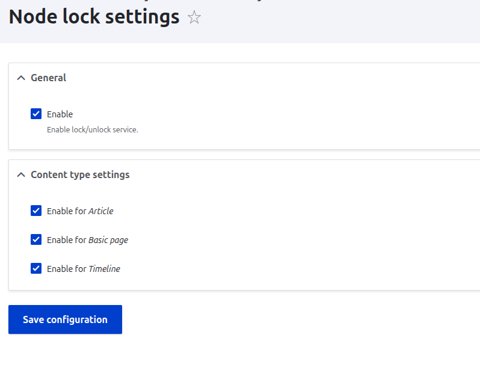
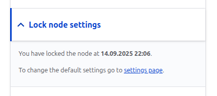
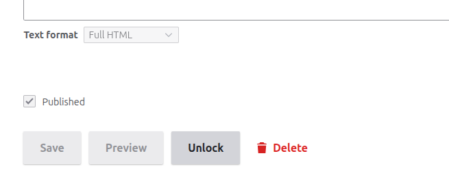
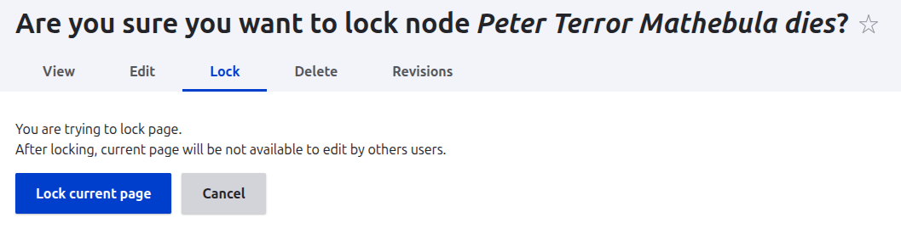
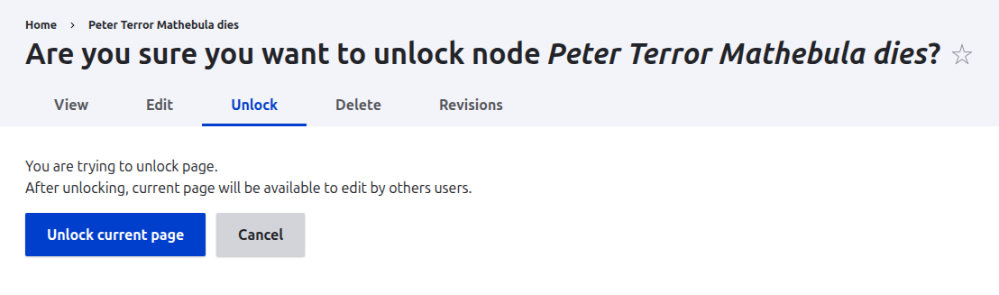
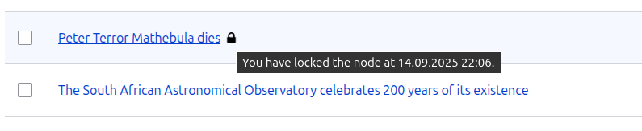
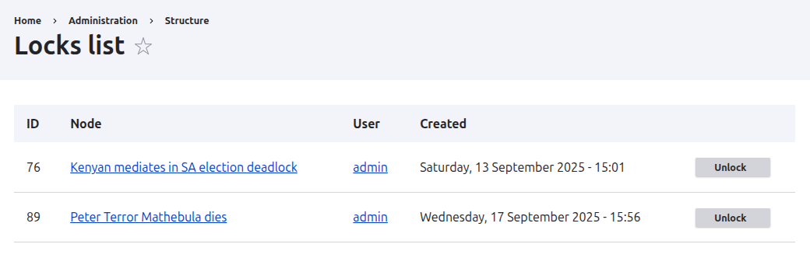

# Module Node Lock

### Description
Module provide:
- Lock and unlock content nodes
- Configure per content type
- View lock details directly in Content Views

Enable the module and navigate to the settings page:

**Configuration → Content authoring → Node lock settings**

```
admin/config/content/node-lock
```
Enable the service and configure it for specific node types.

In the node form sidebar, the Node lock section allows you to check lock information.

To view all lock nodes, go to **Structure → Node lock**:

```
admin/structure/node-lock
```
On this page you can review all locked nodes and remove their "lock" mark directly from the list.


### Media

Settings form



Node edit form (advanced section)



Node edit form (buttons)



Node lock form



Node unlock form



Content view expiration details



List of locks



### Permissions
Module provide permissions *node lock bypass unlock* and *administer node lock configuration*:
- node lock bypass unlock: allow to unlock any node
- administer node lock configuration: allow to change default settings for each node type

### Install
Dependencies:
```
dependencies:
- drupal:node
- drupal:user
```

Install this module using the standard Drupal module installation process.

### Important

Supports D11+ only.
